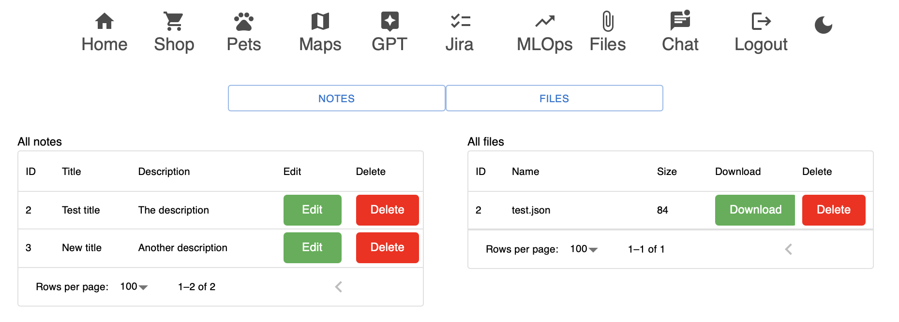
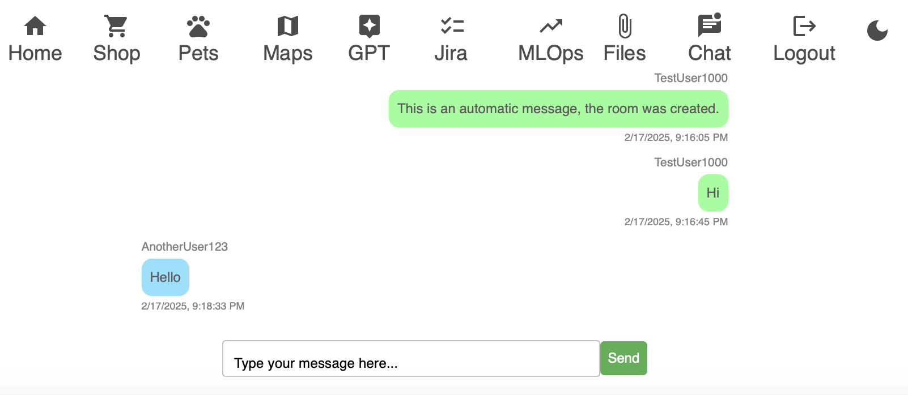

# Web Development and Predictive Analytics Portfolio
<p align="center">
  
</p>
Welcome to my dynamic portfolio, showcasing cutting-edge projects from my Web Development and Predictive Analytics Nanodegrees. This repository is packed with full-stack solutions, ranging from microservices to interactive front-end interfaces and robust data analytics models.

## What's Inside?

- **CloudApp - Interactive Next.js 14 App Shell and Micro Frontend**: Experience the sleek Next.js interface designed to interact seamlessly with the backend services.  [Explore the frontend](./frontend/cloudapp/README.md).
    - A micro frontend setup with an app shell solution to enable independently deployable front-end modules, improving scalability and maintainability. [Check details](#4-maps-with-micro-frontend-module-federation)
- **Microservices Architecture**: Dive into backend API services crafted during my Nanodegree. More about backend services: [cloudapp](./backend/cloudapp/README.md), [petstore](./backend/petstore/README.md), [vehicles-api](./backend/vehicles-api/README.md), [jira-proxy](./backend/web-proxy/README.md).
- **Load Balancer and Reverse Proxy**: Utilize Nginx to efficiently distribute traffic among servers and enhance performance and reliability of applications.   [Read more](https://www.nginx.com).
- **Advanced ML Pipeline**: Leverage my Python-based machine learning pipeline for dynamic customer segmentation, developed during my Predictive Analytics Nanodegree. [See ML details](./backend/ml-pipeline/README.md).
- **Integrated External APIs**: Enhance functionality with third-party services like OpenAI and Jira through customized proxy APIs to navigate CORS issues. [Details on API integration](#5-openai).
- **Real-Time Kafka Chat**: Engage with the Kafka-powered chat application, demonstrating real-time messaging capabilities. [Chat interface](#8-chat).
- **Efficient Logging and CI/CD**: Implement robust logging with Log4j and streamline deployments using Jenkins. [Learn about CI/CD processes](backend/cloudapp/README.md#cicd-with-jenkins).

Example view with ML customer segmentation pipeline and other tabs:


## Quick Start

### Setup with Docker
Note: minimum 16 GB memory is needed to make sure all services can run.
```bash
brew install docker
brew install docker-compose
```

Setup and start databases and esential services with docker-compose:
```bash
docker-compose -f docker-compose-infrastructure.yml up -d
```
Build and start the Java based services, the Python based ml-pipeline and the Next.js based frontend:
```bash
docker-compose -f docker-compose-app.yml up -d
```

Runs the app in the production mode.\
Open http://localhost:5001 to view it in your browser.


If everything is correctly started, you should see a login page with optional Dark Mode:


And you should be able to register and log in, [after starting the backend services, cloudapp is a must, the rest is optional](#2-cloudapp-api), and see the current front-end of the api integrations from the services above:

## 1. Machine learning system for Customer Segmentation
  

MLOps interface for [Customer Segmentation API](backend/ml-pipeline/README.md), the user is able to auto trigger the whole customer segmentation process and generate the latest segmentation plots with these options:
- Add new customer data point to the database.
- Sample reference database with user specified samples.
- Sample reference database with predefined 10-20-50-100-200 amount of samples.  


View results:
- Pictures: correlation between parameters and the different segments.
- Table: current list of customers from postgres db.


## 2. Shop interface for [Cloudapp web store REST API](backend/cloudapp/README.md), 

The user is able to:
- Create new items.
- Add existing items to the cart.
- See and clear the cart.
- Submit cart and check order history.  

Shop API documentation: 
- [Items](http://localhost:8099/cloudapp/swagger-ui/index.html#/item-controller)
- [Cart](http://localhost:8099/cloudapp/swagger-ui/index.html#/cart-controller)
- [Order](http://localhost:8099/cloudapp/swagger-ui/index.html#/order-controller)

## 3. Pet Store interface for the [Pet Store's REST API](backend/petstore/README.md)

The user is able to:
- Add new customer.
- Add a new Pet to existing customers.
- Add new employees with skills and schedules.
- Check availability based on skills and schedules.
- Plan a new schedule for an employee and assign it to a pet.


## 4.  Maps with Micro Frontend Module federation
Left side main CloudApp as App Shell using the Maps micro frontend:
http://localhost:5001/maps  
Right side module federated Maps micro frontend:   
http://localhost:5002

Map interface for integrating Open Street Map with the [Vehicle location service's REST API](backend/vehicles-api/README.md).
The user is able to:
- Click on the map to add new vehicle locations.
- Click on existing locations and check basic info and delete the location.  

Vehicels [API documentation](http://localhost:8880/vehicles/swagger-ui.html)

## 5. OpenAI

OpenAI interface for communicating with
the [OpenAI API](https://platform.openai.com/docs/api-reference), the user is able to:
- Send a prompt to ChatGPT and receive a response..
- Send a prompt to DallE and receive an image response.
  

## 6. Jira
Jira interface for communicating with
the [Jira API](https://platform.openai.com/docs/api-reference), to use it:
- [Register](https://www.atlassian.com/software/jira/free)
- [Create Personal Access Token](https://confluence.atlassian.com/enterprise/using-personal-access-tokens-1026032365.html)
- [Use it for requests](https://developer.atlassian.com/cloud/jira/platform/basic-auth-for-rest-apis/)

The user is able to:

- Create/list/update/delete Jira ticket  


## 7. Notes and Files
A service for creating personal notes and uploading personal files.

- Notes [API documentation](http://localhost:8099/cloudapp/swagger-ui/index.html#/note-controller)
- Files [API documentation](http://localhost:8099/cloudapp/swagger-ui/index.html#/file-controller)
## 8. Chat
A Kafka based chat service, the user is able to:

- Create new chat rooms, furthermore share and enter chat room id  


- Talk to other users in chat rooms  




# Optional API services

If OpenAI and Jira functionality is to be used, follow the instructions below:

## OpenAI API key:
To be stored in the .env file in the frontend/cloudapp root directory in this format:

```bash
NEXT_PUBLIC_OPENAI_KEY==xxxxxxxxxxxxxx
```
## Jira API key, [how to register](https://www.atlassian.com/software/jira/free) and [how to get an API key](https://support.atlassian.com/atlassian-account/docs/manage-api-tokens-for-your-atlassian-account/)

Frontend: Add .env file at frontend/cloudapp root directory in this format:
```bash
NEXT_PUBLIC_JIRA_DOMAIN = 'https://xxxx.atlassian.net'
NEXT_PUBLIC_JIRA_KEY = Y3......2edd (note: no single quotation)
```
NOTE: the next-frontend Docker image needs to be rebuilt after editing the .env file.

## Certificates
[Web Development Nanodegree certficiate](https://graduation.udacity.com/confirm/QDDKHJF9)
[Predictive Analytics for Business Nanodegree certficiate](https://confirm.udacity.com/e/3ac984b2-6128-11ee-a6fe-9be76f9bc811)


