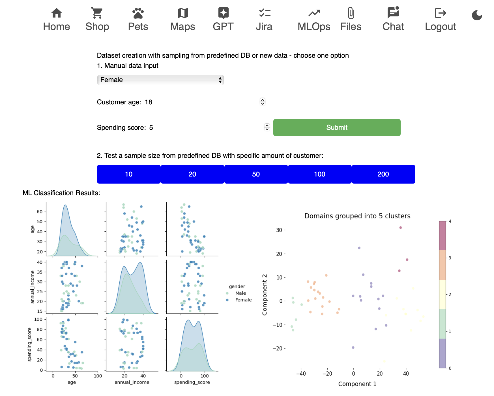
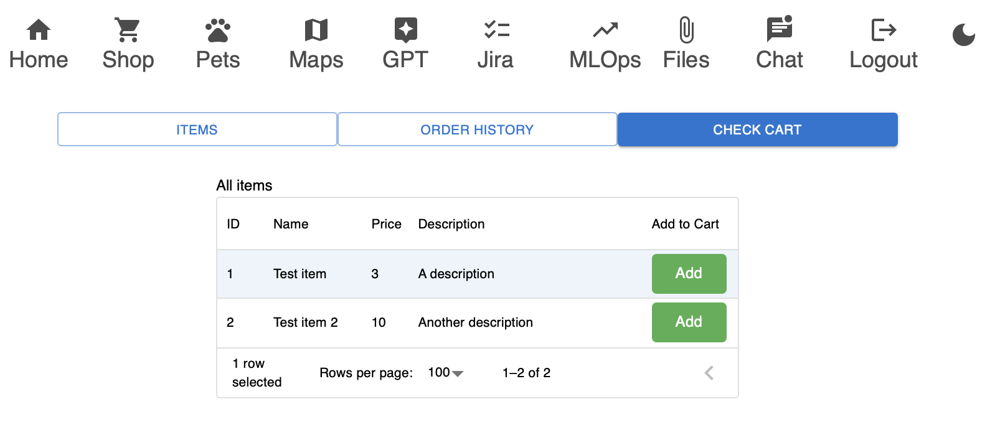
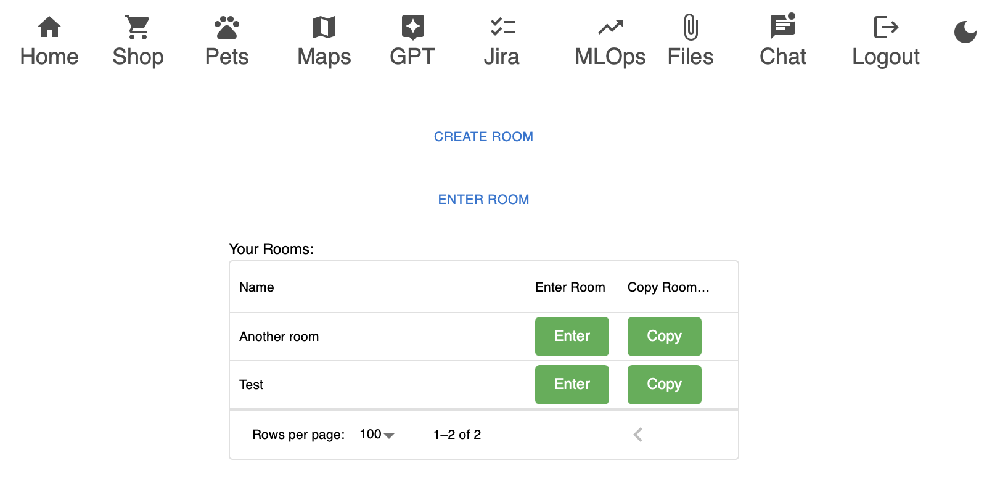

# CloudApp for [API service integration](#required-api-services)

<p align="center">
  
</p>

## REACT front-end

### Option 1. Out of the box mode:  

  Setup and start databases and esential services with docker-compose:
  ```bash
  docker-compose -f docker-compose-infrastructure.yml up -d
  ```
  Build and start the Java based services, the Python based ml-pipeline and the Next.js based frontend:
  ```bash
  docker-compose -f docker-compose-app.yml up -d
  ```

If everything is working as expected, you should be able to:
- Open [http://localhost:5001](http://localhost:5001) for the main Cludapp app-shell to view micro-frontends.
- Open [http://localhost:5002](http://localhost:5002) for the OpenMaps micro-frontend.
- Open [http://localhost:5003](http://localhost:5003) for the Jira micro-frontend.
- Open [http://localhost:5004](http://localhost:5004) for the OpenAI micro-frontend.
- Open [http://localhost:5005](http://localhost:5005) for the MLOps micro-frontend.
- Open [http://localhost:5006](http://localhost:5006) for the Petstore micro-frontend.

### Option 2. Dev mode:

Install packages and start React front-end from root of cloudapp-shell and /remote microfrontends:

```bash
npm install
npm run dev
```

Runs the app in the development mode.

The page will reload when you make changes.\
You may also see any lint errors in the console.

If everything is correctly started, you should see a login page with optional Dark Mode:


And you should be able to register and log in, [after starting the backend services, cloudapp is a must, the rest is optional](#2-cloudapp-api), and see the current front-end of the api integrations from the services above:

## 1. Machine learning system for Customer Segmentation
  
MLOps interface for [Customer Segmentation API](../../backend/ml-pipeline/README.md), the user is able to:
- Add new customer data point to the database.
- Sample reference database with user specified samples.
- Sample reference database with predefined 10-20-50-100-200 amount of samples.
  All these steps will retrigger the segmentation process and then the pictures and tables will update with the new results.

View results:
- Pictures: correlation between parameters and the different segments
- Table: current db from postgres.


## 2. Shop interface for [Cloudapp web store REST API](../../backend/cloudapp/README.md),

The user is able to:
- Create new items.
- Add existing items to the cart.
- See and clear the cart.
- Submit cart and check order history.

Shop API documentation:
- [Items](http://localhost:8099/cloudapp/swagger-ui/index.html#/item-controller)
- [Cart](http://localhost:8099/cloudapp/swagger-ui/index.html#/cart-controller)
- [Order](http://localhost:8099/cloudapp/swagger-ui/index.html#/order-controller)

## 3. Pet Store interface for the [Pet Store's REST API](../../backend/petstore/README.md)
The module is built as Micro Frontend:
1. Left side main CloudApp-Shell as App Shell using the Petstore micro frontend:  
   http://localhost:5001/petstore
2. Right side module federated Petstore micro frontend:   
   http://localhost:5006  

  

The user is able to:
- Add new customer.
- Add a new Pet to existing customers.
- Add new employees with skills and schedules.
- Check availability based on skills and schedules.
- Plan a new schedule for an employee and assign it to a pet.


## 4.  Maps with Micro Frontend Module federation
1. Left side main CloudApp-Shell as App Shell using the Maps micro frontend:
http://localhost:5001/maps  
2. Right side module federated Maps micro frontend:   
http://localhost:5002  


Map interface for integrating Open Street Map with the [Vehicle location service's REST API](backend/vehicles-api/README.md).
The user is able to:
- Click on the map to add new vehicle locations.
- Click on existing locations and check basic info and delete the location.

Vehicels [API documentation](http://localhost:8880/vehicles/swagger-ui.html)

## 5. OpenAI

OpenAI interface for communicating with
the [OpenAI API](https://platform.openai.com/docs/api-reference), the user is able to:
- Send a prompt to ChatGPT and receive a response..
- Send a prompt to DallE and receive an image response.

The module is built as Micro Frontend:
1. Left side main CloudApp-Shell as App Shell using the OpenAI micro frontend:  
   http://localhost:5001/openai
2. Right side module federated OpenAI micro frontend:   
   http://localhost:5004


## 6. Jira
Jira interface for communicating with
the [Jira API](https://platform.openai.com/docs/api-reference), to use it:
- [Register](https://www.atlassian.com/software/jira/free)
- [Create Personal Access Token](https://confluence.atlassian.com/enterprise/using-personal-access-tokens-1026032365.html)
- [Use it for requests](https://developer.atlassian.com/cloud/jira/platform/basic-auth-for-rest-apis/)

The user is able to:

- Create/list/update/delete Jira ticket
1. Left side main CloudApp-Shell as App Shell using the Jira micro frontend:  
   http://localhost:5001/jira
2. Right side module federated Jira micro frontend:   
   http://localhost:5003


## 7. Notes and Files
A service for creating personal notes and uploading personal files.

- Notes [API documentation](http://localhost:8099/cloudapp/swagger-ui/index.html#/note-controller)
- Files [API documentation](http://localhost:8099/cloudapp/swagger-ui/index.html#/file-controller)
## 8. Chat
A Kafka based chat service, the user is able to:

- Create new chat rooms, furthermore share and enter chat room id


- Talk to other users in chat rooms


# Optional API services

If OpenAI and Jira functionality is to be used, follow the instructions below:

## OpenAI API key:

1. Out of the box: edit this in docker-compose-app.yml:  
```
#NEXT_PUBLIC_OPENAI_KEY: sk-za-------YOUR-API-KEY------8Ie
```
2. Local run: Add .env file at frontend/remote/openapi directory in this format:

```bash
NEXT_PUBLIC_OPENAI_KEY_LOCAL==xxxxxxxxxxxxxx
```
## Jira API key, [how to register](https://www.atlassian.com/software/jira/free) and [how to get an API key](https://support.atlassian.com/atlassian-account/docs/manage-api-tokens-for-your-atlassian-account/)

Two options:
1. Out of the box: edit this in docker-compose-app.yml:
```
#NEXT_PUBLIC_JIRA_DOMAIN: 'https://your-jira-instance.atlassian.net'
#NEXT_PUBLIC_JIRA_KEY: Y3NhYmFqYWthYm-------YOUR-API-KEY------SDA9REUzRjY4N0M=
```
2. Local run: Add .env file at frontend/remote/jira directory in this format:
```bash
NEXT_PUBLIC_JIRA_DOMAIN_LOCAL = 'https://xxxx.atlassian.net'
NEXT_PUBLIC_JIRA_KEY_LOCAL = Y3......2edd (note: no single quotation)
```
NOTE: the next-frontend Docker image needs to be rebuilt after editing the .env file.
