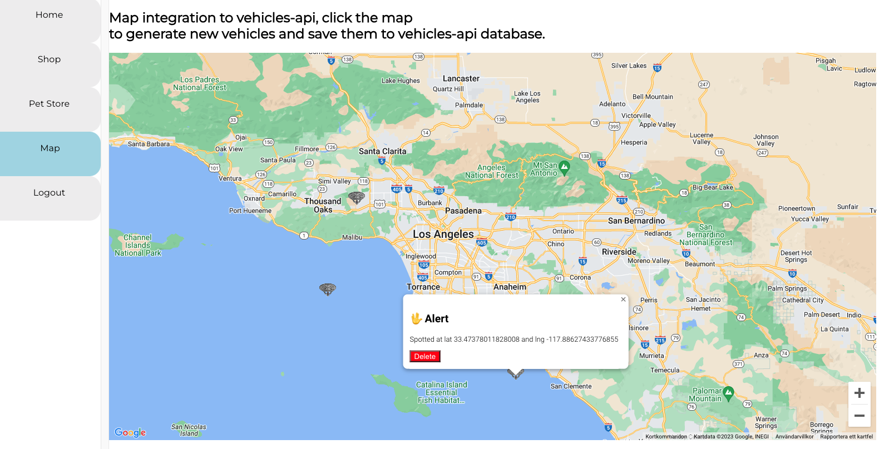

# React Apiview App for [backend integration](../README.md)

## Required api services

In the repository start these 3 backend services in different terminals:

eCommerce api:

```
cd ecommerce
mvn clean package
java -jar target/ecommerce-0.0.1-SNAPSHOT.jar
```

Vehicles api:

```
cd vehicles-api
mvn clean package
java -jar target/vehicles-api-0.0.1-SNAPSHOT.jar
```

Pet Store api:

```
Install msql, eg. on mac:
brew install mysql
brew services start mysql

Start mysql and flush privileges, if issues arise:
mysql -u root    
FLUSH PRIVILEGES;
ALTER USER 'root'@'localhost' IDENTIFIED BY ‘root’;

start the service from repo root:
cd petstore
mvn clean package
java -jar target/petstore-0.0.1-SNAPSHOT.jar
```

Google Maps API key, [how to get](https://developers.google.com/maps/documentation/embed/get-api-key):

```
To be stored in the .env file in the root directory in this format:
REACT_APP_GMAPS_API_KEY=xxxxxxxxxxxxxx
```

OpenAI API key:

```
To be stored in the .env file in the root directory in this format:
REACT_APP_OPENAI_KEY==xxxxxxxxxxxxxx
```
Jira API key, [how to register](https://www.atlassian.com/software/jira/free) and [how to get an API key](https://support.atlassian.com/atlassian-account/docs/manage-api-tokens-for-your-atlassian-account/)

```
To be stored in the .env file in the root directory in this format:
REACT_APP_JIRA_KEY=XXXXXXXXXX
Together with your requested domain name
REACT_APP_JIRA_DOMAIN="https:/XXXXX.atlassian.net"
```
### Web-proxy
Start [Web Proxy API](../web-proxy/README.md) to avoid CORS issue with Jira [background](https://jira.atlassian.com/browse/JRASERVER-59101?focusedCommentId=2406855&page=com.atlassian.jira.plugin.system.issuetabpanels%3Acomment-tabpanel#comment-2406855)
```
mvn clean package
java -jar target/web-proxy-0.0.1-SNAPSHOT.jar
```
### REACT front-end

Install packages and start React front-end from root of react-apiview-app:

### `npm install`

### `npm start`

Runs the app in the development mode.\
Open [http://localhost:5001](http://localhost:5001) to view it in your browser.

The page will reload when you make changes.\
You may also see any lint errors in the console.

If everything is correctly started, you should see a login page:


And you should be able to log in, and see the current front-end of the api integrations from the services above:


Shop interface for [eCommerce web store REST API](../ecommerce/README.md), the user is able to:

- Create new items.
- Add existing items to the cart.
- See and clear the cart.
- Submit cart and check order history.
  

Pet Store interface for the [Pet Store's REST API](../petstore/README.md), the user is able to:

- Add new customer.
- Add a new Pet to existing customers.
- Add new employees with skills and schedules.
- Check availability based on skills and schedules.
- Plan a new schedule for an employee and assign it to a pet.
  

### GoogleMaps
Map interface for integrating Google Maps API with the [Vehicle location service's REST API](../vehicles-api/README.md),
the user is able to:

- Click on the map to add new vehicle locations.
- Click on existing locations and check basic info and delete the location.
  

### OpenAI
OpenAI interface for communicating with
the [OpenAI API](https://platform.openai.com/docs/api-reference), the user is able to:

- Send a prompt and receive a Completion.
- Send a prompt and receive two DallE image response.
  

### Jira
Jira interface for communicating with
the [Jira API](https://platform.openai.com/docs/api-reference), to use it:
- [Register](https://www.atlassian.com/software/jira/free) 
- [Create Personal Access Token](https://confluence.atlassian.com/enterprise/using-personal-access-tokens-1026032365.html) 
- [Use it for requests](https://developer.atlassian.com/cloud/jira/platform/basic-auth-for-rest-apis/)

The user is able to:

- Create a new Jira ticket
  
- List existing tickets and delete them
    
- Update existing tickets
    
- See updated values
    


